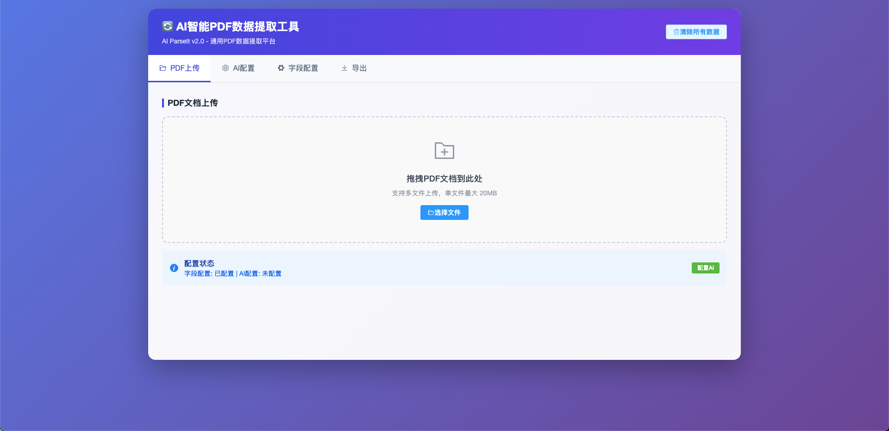
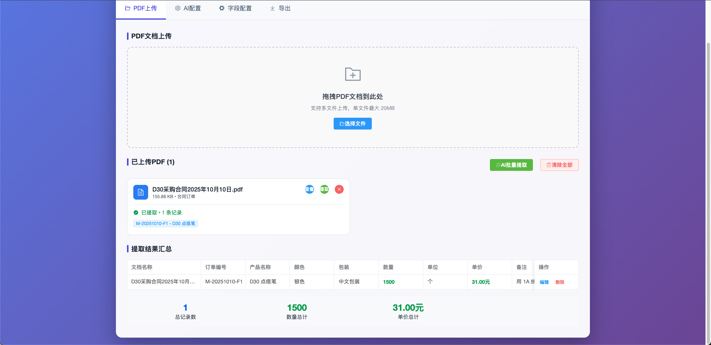
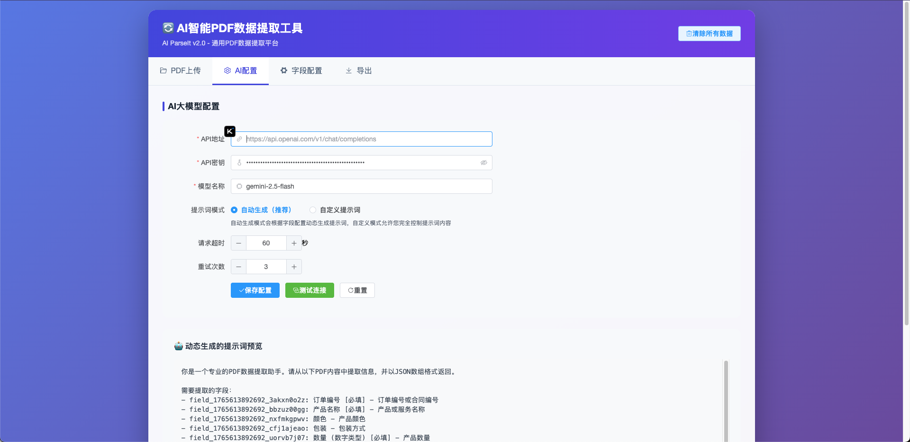
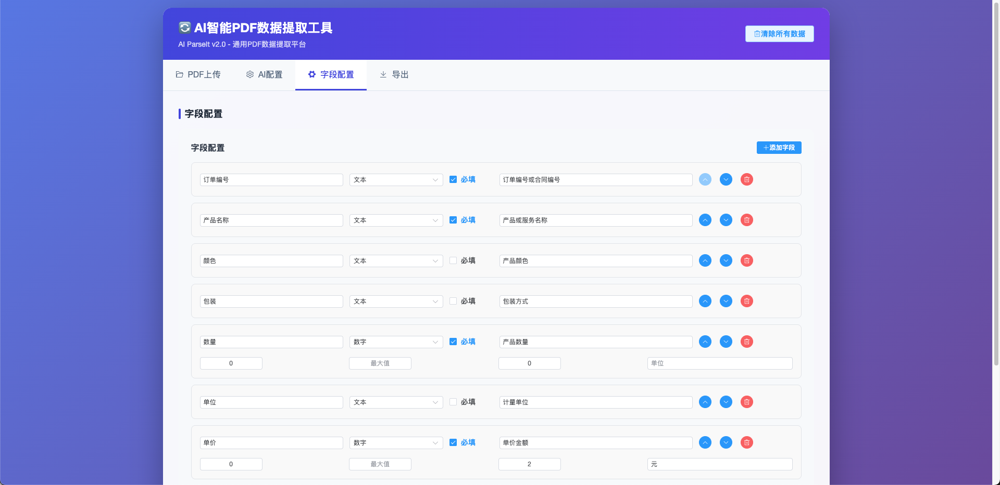
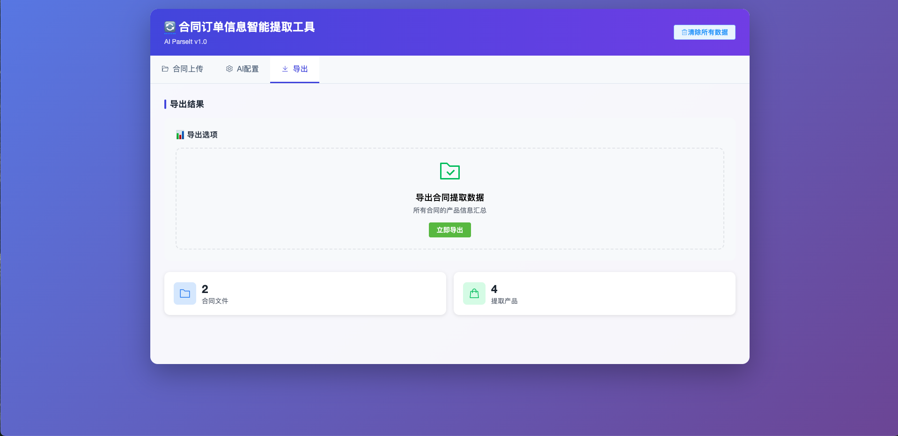

# AI 解析 PDF 产品信息工具 - AI ParseIt

一个基于 Vue3 和 AI 技术的 PDF 产品信息提取工具，支持 PDF 文件上传、自动提取产品信息、Excel 数据导出。

## � 界面预览

### 主界面



### PDF 预览



### AI 配置



### 提取结果



### 数据导出



## �📋 功能特性

### 📄 PDF 文件管理

- 支持 PDF 文件批量上传
- PDF 文件预览功能
- 提取结果可视化展示

### 🤖 AI 智能提取

- 集成大模型 API，自动从 PDF 中提取产品信息
- 支持自定义 AI 提示词和参数配置
- 批量提取功能，提高工作效率

### 📊 Excel 数据处理

- 支持 Excel 文件导出

### ✅ 信息匹配

- 自动匹配 PDF 提取信息
- 手动匹配调整功能

### 📤 数据导出

- 提取数据 Excel 导出

### 💾 数据持久化

- 本地存储所有数据，无需服务器
- 支持数据清除和重置

## 🛠️ 技术栈

- **前端框架**: Vue 3
- **UI 组件库**: Element Plus
- **Excel 处理**: SheetJS
- **PDF 处理**: PDF.js
- **样式框架**: Tailwind CSS
- **图标库**: Element Plus Icons

## 🚀 快速开始

### 环境要求

无需特殊环境，现代浏览器即可运行：

- Chrome (推荐)
- Firefox
- Safari
- Edge

### 本地运行

1. 克隆项目

```bash
git clone <repository-url>
cd ai-parseit
```

2. 启动本地服务器

```bash
# 使用Python 3
python3 -m http.server 8000

# 或使用Node.js
npx http-server -p 8000
```

3. 访问应用
   打开浏览器访问 `http://localhost:8000`

### 在线部署

项目已配置 Vercel 部署支持，可直接部署：

1. Fork 本项目到您的 GitHub 账户
2. 访问 [Vercel](https://vercel.com/)
3. 导入您的 GitHub 仓库
4. 点击"Deploy"按钮

## 📖 使用指南

### 1. 上传 PDF 文件

- 点击"PDF 上传"标签
- 拖放或点击上传 PDF 文件
- 上传完成后可在列表中查看

### 2. 配置 AI 连接

- 点击"AI 配置"标签
- 填写 API 地址、密钥和模型名称
- 点击"测试连接"验证配置
- 保存配置

### 3. 提取 PDF 数据

- 返回"PDF 上传"标签
- 点击"提取数据"按钮开始提取
- 或使用"批量提取"处理所有 PDF 文件

### 4. 导出结果

- 点击"导出提取数据"导出所有提取的产品信息

## ⚙️ AI 配置说明

### 支持的模型

- OpenAI (gpt-4o, gpt-4, gpt-3.5-turbo)
- Anthropic (claude-3-sonnet, claude-3-opus)
- 阿里云通义千问 (qwen-max, qwen-plus)
- 百度文心一言
- 字节跳动豆包

### 配置参数

- **API 地址**: 模型 API 的完整 URL
- **API 密钥**: 访问 API 的密钥
- **模型名称**: 使用的具体模型名称
- **提示词**: 自定义 AI 提取规则
- **请求超时**: API 请求超时时间（秒）
- **重试次数**: 请求失败后的重试次数

## 📁 项目结构

```
├── index.html          # 主页面
├── package.json        # 项目配置
├── vercel.json         # Vercel部署配置
└── README.md           # 项目文档
```

## 🔧 开发说明

### 依赖管理

项目使用 CDN 引入所有依赖，无需安装：

- Vue 3
- Element Plus
- SheetJS
- PDF.js
- Tailwind CSS

### 自定义开发

1. 修改 `index.html` 中的 Vue 组件逻辑
2. 调整样式或添加新功能
3. 使用本地服务器测试

## 📄 许可证

本项目采用 [MIT](https://opensource.org/licenses/MIT) 许可证。

## 🤝 贡献

欢迎提交 Issue 和 Pull Request 来帮助改进项目！

### 贡献指南

1. Fork 本项目
2. 创建您的特性分支 (`git checkout -b feature/AmazingFeature`)
3. 提交您的更改 (`git commit -m 'Add some AmazingFeature'`)
4. 推送到分支 (`git push origin feature/AmazingFeature`)
5. 打开一个 Pull Request

## 📞 联系方式

如有问题或建议，请通过以下方式联系：

- GitHub Issues: [项目 Issues 页面](https://github.com/yourusername/reconciliation-/issues)

## 🙏 致谢

- [Vue.js](https://vuejs.org/) - 渐进式 JavaScript 框架
- [Element Plus](https://element-plus.org/) - 企业级 UI 组件库
- [SheetJS](https://sheetjs.com/) - Excel 文件处理库
- [PDF.js](https://mozilla.github.io/pdf.js/) - PDF 文档处理库
- [Tailwind CSS](https://tailwindcss.com/) - 实用优先的 CSS 框架

---

**Enjoy using AI ParseIt! 🎉**
